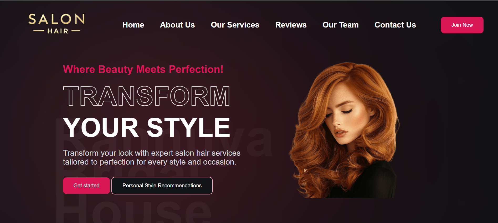

# 💇‍♀️ Salon Hair Appointment Booking System ✨  

A full-featured salon management platform where customers, staff, and admins can interact seamlessly.

  

## 🚀 Features

### 👥 User Roles
| Role | Capabilities |
|------|-------------|
| 👩‍🦰 **Customer** | Register/Login, Book Appointments, Upload Style Photos, Get Recommendations |
| 👔 **Staff** | Manage Appointments, View Customer Profiles, Respond to Requests |
| 👑 **Admin** | Full System Control, Manage Services/Stylists, Send Broadcast Emails |

## 📸 Screenshots

  
   
  

## 🛠️ Technologies Used
- Frontend: HTML5, CSS3, JavaScript
- Backend: Node.js/Express or PHP
- Database: MySQL/MongoDB
- Email: phpmail

