# 💇‍♀️ Salon Hair Appointment Booking System ✨  

A full-featured salon management system with CRUD operations for seamless interaction between customers, staff, and admins.

 

## 🚀 Features

### 👥 User Roles
| Role | Capabilities |
|------|-------------|
| 👩‍🦰 **Customer** | Register/Login, Book Appointments, Upload Style Photos (CRUD operation), Get Recommendations |
| 👔 **Staff** | Manage Appointments, View Customer Profiles, Respond to Requests, Send Emails after Cancelled Appointments |
| 👑 **Admin** | Full System Control, Manage Services (CRUD operation), Send Broadcast Emails, Add Customers & Staff (CRUD operation)|

### 🛠️ Core Functionalities
- 📅 Book an appointment by selecting a main service. The system will reduce your loyalty points automatically. 💳 Your selected service will be shown clearly, and if you want, you can pick other services using the checkboxes ✅.
- 💬 Feedback system (shown on main page)
- 📸 Personalized style recommendation (based on uploaded photos and gender)
- 📅 Calendar view for appointments
- ✏️ Profile edit 
- 🧾 Service insertion and management
- 🔐 Authentication for Customers, Staff, and Admins
- 🧑‍💻 Customers can send inquiries or messages directly through the website.
- 📧 Email Notifications –
     <ul>
        <li>
            <strong>📩 Cancellation Alerts:</strong> Customers and staff receive an instant email when an appointment is canceled.
        </li>
        <li>
            <strong>✅ Appointment Confirmation:</strong> An email is automatically sent to confirm booking details, including the service, date, and time.
        </li>
        <li>
            <strong>📥 Email Replies:</strong> Admin responses are delivered directly to the customer's registered email address.
        </li>
    </ul>
## 📸 Screenshots

### 🏠 Homepage, Our Team Section, Added Service page , send message section and Review Page
| Homepage                             | Team Section                                               |         Added Service Section                |   
|-------------------------------------|-------------------------------------------------------------|-----------------------------------------------------|
|  |    |  | 

 |     Send message section               |     Review page           |
 |-----------------------------------------------------|-----------------------------------------------------|
 | 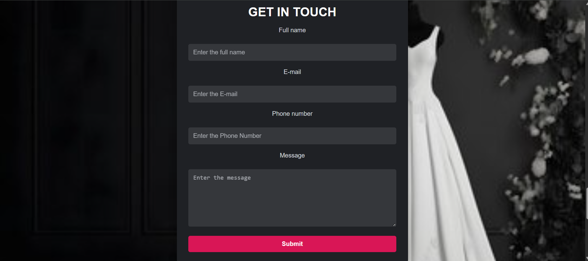 |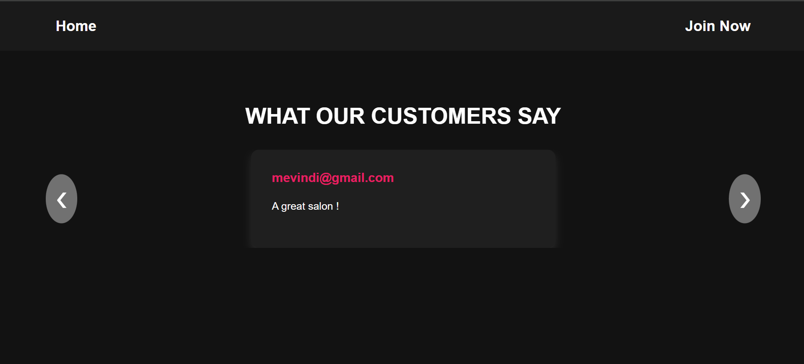 |

 ### 🔐 Authentication
| Login Page                           | Register Page                         |
|--------------------------------------|----------------------------------------|
| 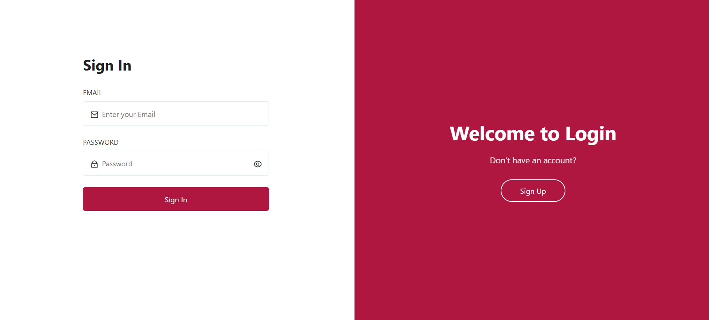 | 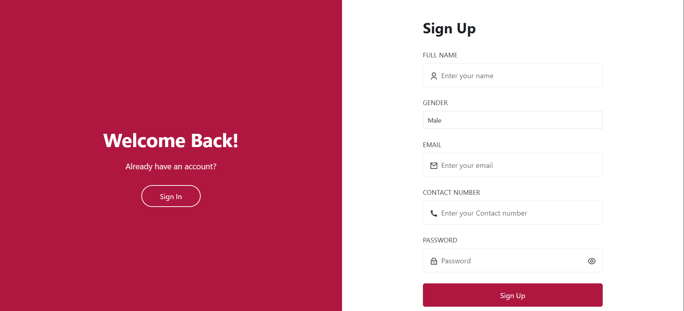 |

### 📊 Customer Dashboard with calendar view 
| Customer Dashboard                          |
|-------------------------------------------|
| 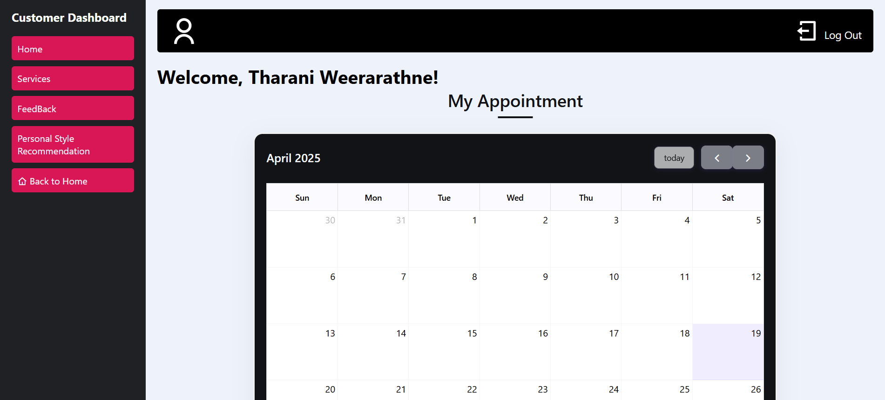 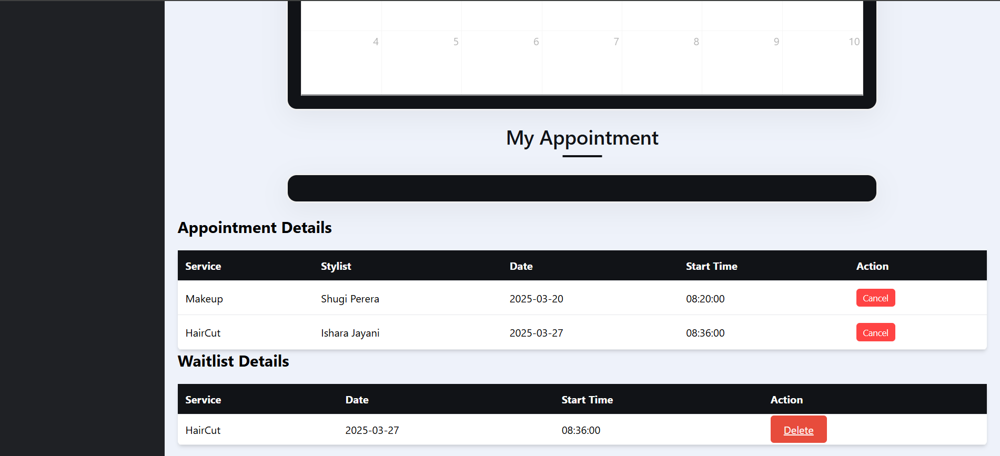  |

### 💬 Feedback , Send a Response to Customer Feedback
| Feedback Page                        |Send a Response to Customer Feedback                         |
|--------------------------------------|----------------------------------------|
| 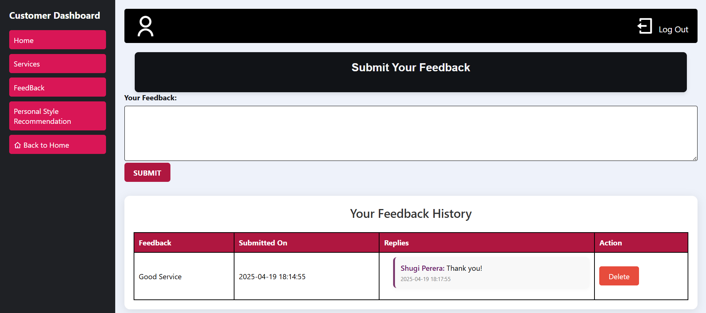 | 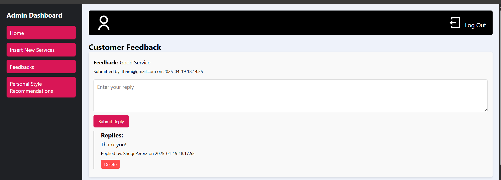 |

### 📚 Book a service, reduce loyalty points 💳
| Book a service, reduce loyalty points                     |
|--------------------------------------|
| 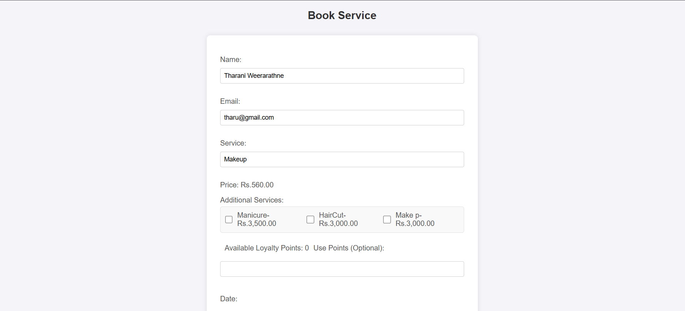 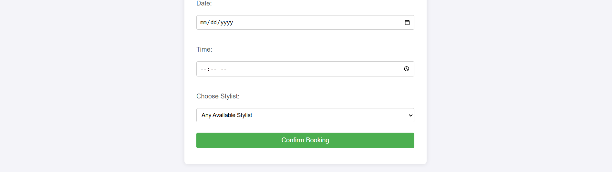 |

### 📝 Insert Services (Only Admin)
| Insert Services                      |
|--------------------------------------|
| 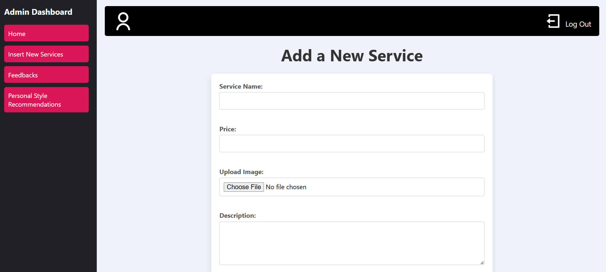  |

### Add staff and customers (Only Admin)
| Insert Services                      |
|--------------------------------------|
| 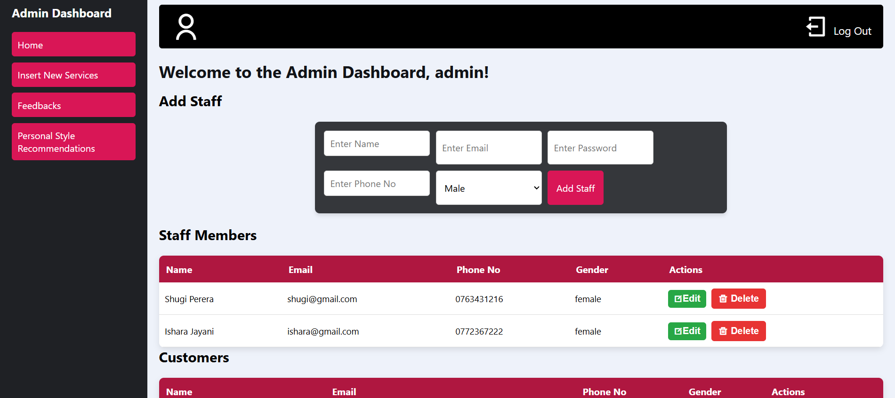 |

### 💇‍♀️ Available Services in customer dashboard
| Insert Services                      |
|--------------------------------------|
| 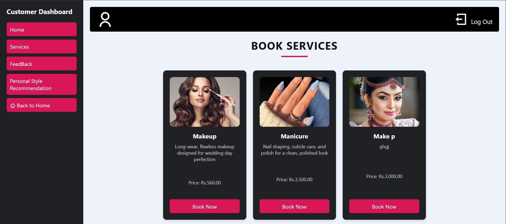 |
---

## 🛠️ Technologies Used
- **Frontend**: HTML5, CSS3, JavaScript  
- **Backend**: PHP 
- **Database**: MySQL 
- **Email Integration**: PHPMailer  

---

<strong>🌟 Star the repo if you like it! Contributions are welcome.</strong> 🚀

